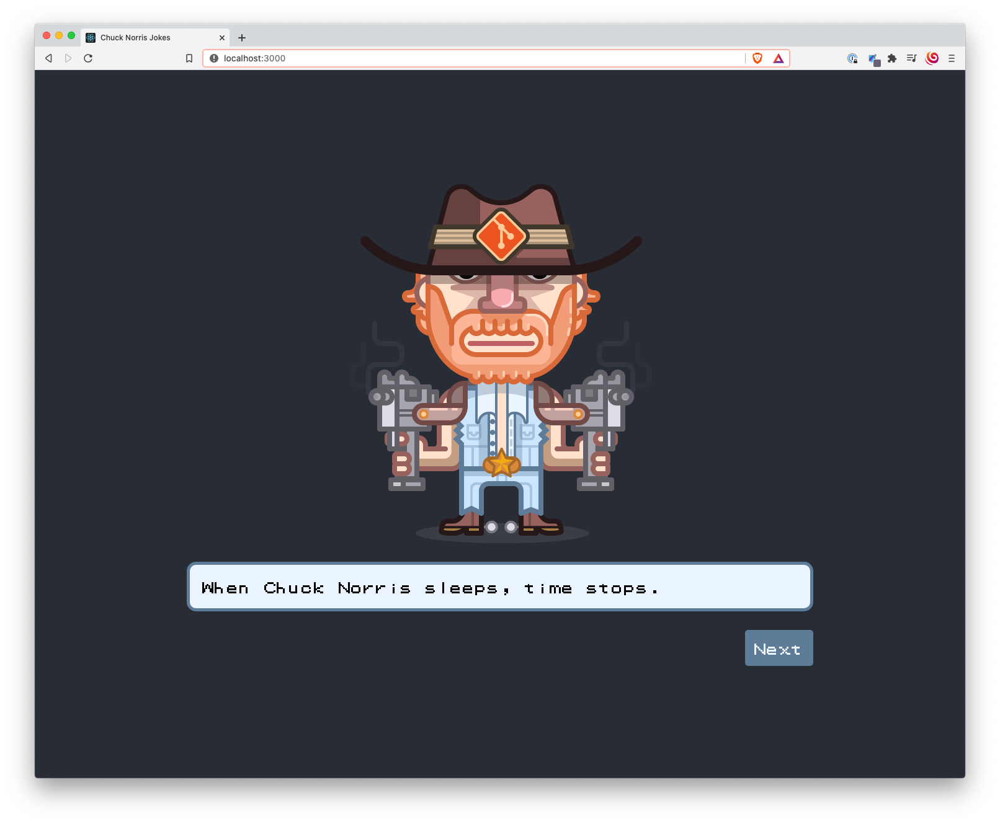

# Consuming the Chuck Norris API from ReacJS

This project is for demo purposes only, and is used to demonstrate a very simple approach to incremental software development.

It leverages a public API available [here](https://api.chucknorris.io/), which does return random jokes about our legendary Chuck Norris.

It displays the provided jokes in a Gameboy-like dialog style with a typewriter effect.

**Legal disclaimer:** This project and its creators are not affiliated with Chuck Norris, any motion picture corporation, any television corporation, parent, or affiliate corporation. All motion pictures, products, and brands mentioned on this website are the respective trademarks and copyrights of their owners. All material on this website is intended for humorous entertainment (satire ) purposes only. The content on this project is not necessarily true and should not be regarded as truth.
